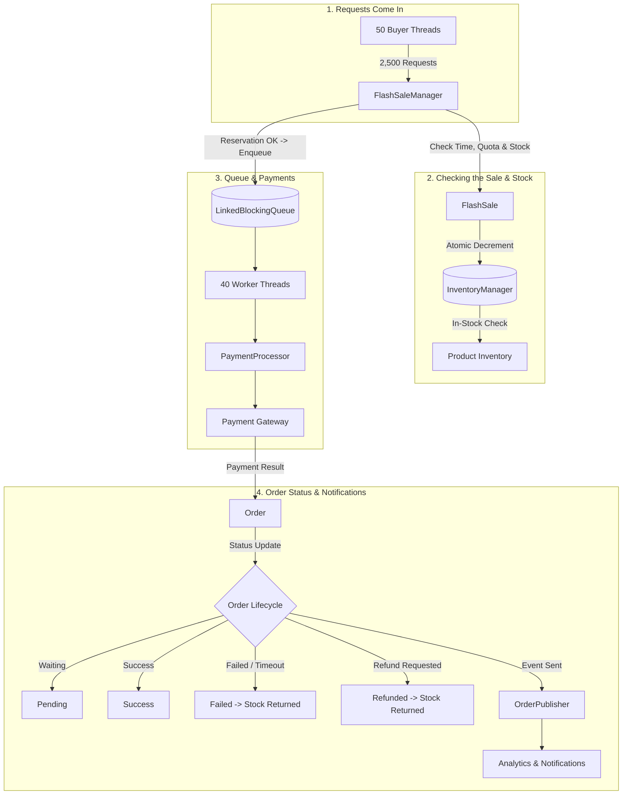
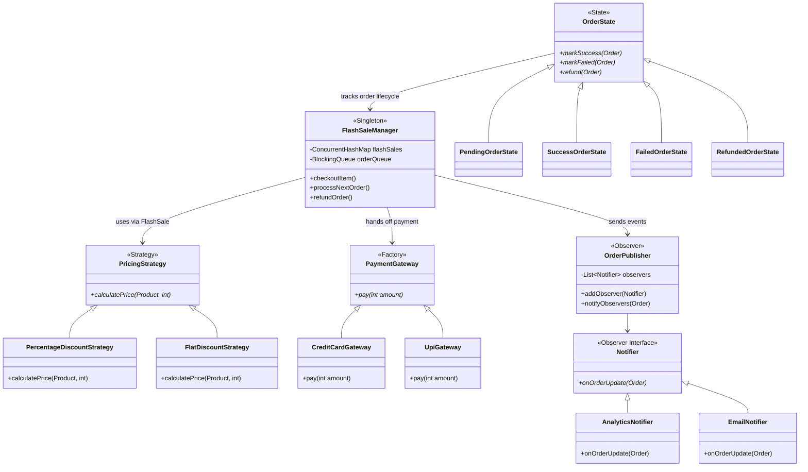

# Multi-Tenant Flash Sale Concurrency Engine

A multi-threaded Java project that simulates a flash sale system. It handles multiple people trying to buy the same limited stock at once, keeps track of per-user purchase limits, supports different pricing rules, and processes payments in the background — all across several sales running at the same time.

---

## 1. How It Works



---

## 2. Class Overview



---

## 3. Design Patterns Used

| Pattern | Classes | What it's doing here |
|---|---|---|
| Singleton | `FlashSaleManager` | One shared instance that handles all checkouts, routes requests to the right sale, and runs the background worker threads. |
| Strategy | `PricingStrategy`, `PercentageDiscountStrategy`, `FlatDiscountStrategy` | Lets each sale plug in its own pricing rule to work out the discounted total. |
| State | `OrderState`, `PendingOrderState`, `SuccessOrderState`, `FailedOrderState`, `RefundedOrderState` | Controls which order status changes are allowed, so you can't do things like refund an order twice. |
| Observer | `OrderPublisher`, `Notifier`, `AnalyticsNotifier`, `EmailNotifier` | Sends out updates whenever an order finishes, fails, or gets refunded, without tying that logic to the checkout code. |
| Factory | `PaymentGateway`, `PaymentMethodEnum`, `CreditCardGateway`, `UpiGateway` | Picks the right payment method to run based on what the user chose. |

### Pricing Rules Used in the Simulation

- **Percentage Discount** (`PercentageDiscountStrategy`): Takes a percentage off (10%, 20%, or 30%) the base price.
- **Flat Discount** (`FlatDiscountStrategy`): Subtracts a fixed amount ($25 or $50) from the base price, never going below zero.

---

## 4. Simulation Results

Run with 50 buyer threads, 40 payment worker threads, 5 sales running at once, and 2,000 total units spread across 8 products.

Payments aren't guaranteed to succeed — the `PaymentProcessor` randomly fails some of them on purpose, and each payment also goes through a random delay before it settles. This is just to make the simulation feel closer to a real payment gateway instead of everything resolving instantly.

```
========================================================
========== PART 1: METRICS BEFORE REFUNDS ==============
========================================================
Total Sale Runtime:             4,323 ms (4.32 seconds)
Request Ingress Throughput:     578.26 requests/sec
Payment Processing Throughput:  504.24 orders/sec
System Efficiency:              94.55%
--------------------------------------------------------
Total Checkout Requests:        2,500
Confirmed SUCCESS Orders:       1,961
Confirmed FAILED Orders:        219
Rejected Requests (OOS/Quota):  320
Total Initial Stock:            2,000 units
Total Stock After Sale:         39 units
Total Stock Consumed:           1,961 units (Exact match with SUCCESS orders)
--------------------------------------------------------
--- Per-Sale & Per-Product Stock Breakdown (Pre-Refund) ---
>> Sale ID 1 (10% Discount Strategy):
   [1] Smartphone           :   0 / 50 left
   [2] Wireless Headphones  :   4 / 50 left
   [3] Smart Watch          :   0 / 50 left
   [4] Mechanical Keyboard  :   0 / 50 left
   [5] Gaming Mouse         :   0 / 50 left
   [6] 4K Monitor           :   0 / 50 left
   [7] USB-C Hub            :   0 / 50 left
   [8] Portable SSD         :   0 / 50 left
   >> Subtotal for Sale 1   :   4 / 400 remaining

>> Sale ID 2 (20% Discount Strategy):
   [1] Smartphone           :   0 / 50 left
   [2] Wireless Headphones  :   0 / 50 left
   [3] Smart Watch          :   0 / 50 left
   [4] Mechanical Keyboard  :   1 / 50 left
   [5] Gaming Mouse         :   0 / 50 left
   [6] 4K Monitor           :   0 / 50 left
   [7] USB-C Hub            :   1 / 50 left
   [8] Portable SSD         :   0 / 50 left
   >> Subtotal for Sale 2   :   2 / 400 remaining

>> Sale ID 3 (30% Discount Strategy):
   [1] Smartphone           :   1 / 50 left
   [2] Wireless Headphones  :   1 / 50 left
   [3] Smart Watch          :   0 / 50 left
   [4] Mechanical Keyboard  :   0 / 50 left
   [5] Gaming Mouse         :   8 / 50 left
   [6] 4K Monitor           :   0 / 50 left
   [7] USB-C Hub            :   0 / 50 left
   [8] Portable SSD         :   0 / 50 left
   >> Subtotal for Sale 3   :  10 / 400 remaining

>> Sale ID 4 (Flat $25 Discount Strategy):
   [1] Smartphone           :   0 / 50 left
   [2] Wireless Headphones  :   0 / 50 left
   [3] Smart Watch          :   0 / 50 left
   [4] Mechanical Keyboard  :   2 / 50 left
   [5] Gaming Mouse         :   9 / 50 left
   [6] 4K Monitor           :   0 / 50 left
   [7] USB-C Hub            :   0 / 50 left
   [8] Portable SSD         :   0 / 50 left
   >> Subtotal for Sale 4   :  11 / 400 remaining

>> Sale ID 5 (Flat $50 Discount Strategy):
   [1] Smartphone           :   0 / 50 left
   [2] Wireless Headphones  :   0 / 50 left
   [3] Smart Watch          :   0 / 50 left
   [4] Mechanical Keyboard  :   3 / 50 left
   [5] Gaming Mouse         :   8 / 50 left
   [6] 4K Monitor           :   0 / 50 left
   [7] USB-C Hub            :   1 / 50 left
   [8] Portable SSD         :   0 / 50 left
   >> Subtotal for Sale 5   :  12 / 400 remaining
--------------------------------------------------------
[Observer] Pre-Refund Revenue: $504,601
[Observer] Pre-Refund Success: 1,961
========================================================

========================================================
========== PART 2: METRICS AFTER REFUNDS ===============
========================================================
Valid Refunds Attempted:        103
Valid Refunds Succeeded:        103
False Refunds Attempted:        110
False Refunds Blocked by State: 110 (100% State Machine Enforcement)
--------------------------------------------------------
Total Initial Stock:            2,000 units
Final Total Remaining Stock:    142 units
Net Total Stock Consumed:       1,858 units
Total Restocked via Refunds:    103 units
--------------------------------------------------------
--- Per-Sale & Per-Product Stock Breakdown (Post-Refund) ---
>> Sale ID 1:
   [1] Smartphone           :   2 / 50 left
   [2] Wireless Headphones  :   9 / 50 left
   [3] Smart Watch          :   2 / 50 left
   [4] Mechanical Keyboard  :   3 / 50 left
   [5] Gaming Mouse         :   2 / 50 left
   [6] 4K Monitor           :   1 / 50 left
   [7] USB-C Hub            :   0 / 50 left
   [8] Portable SSD         :   4 / 50 left
   >> Subtotal for Sale 1   :  23 / 400 remaining

>> Sale ID 2:
   [1] Smartphone           :   0 / 50 left
   [2] Wireless Headphones  :   3 / 50 left
   [3] Smart Watch          :   2 / 50 left
   [4] Mechanical Keyboard  :   2 / 50 left
   [5] Gaming Mouse         :   4 / 50 left
   [6] 4K Monitor           :   1 / 50 left
   [7] USB-C Hub            :   5 / 50 left
   [8] Portable SSD         :   2 / 50 left
   >> Subtotal for Sale 2   :  19 / 400 remaining

>> Sale ID 3:
   [1] Smartphone           :   3 / 50 left
   [2] Wireless Headphones  :   5 / 50 left
   [3] Smart Watch          :   3 / 50 left
   [4] Mechanical Keyboard  :   3 / 50 left
   [5] Gaming Mouse         :   8 / 50 left
   [6] 4K Monitor           :   5 / 50 left
   [7] USB-C Hub            :   2 / 50 left
   [8] Portable SSD         :   5 / 50 left
   >> Subtotal for Sale 3   :  34 / 400 remaining

>> Sale ID 4:
   [1] Smartphone           :   4 / 50 left
   [2] Wireless Headphones  :   4 / 50 left
   [3] Smart Watch          :   5 / 50 left
   [4] Mechanical Keyboard  :   5 / 50 left
   [5] Gaming Mouse         :  11 / 50 left
   [6] 4K Monitor           :   2 / 50 left
   [7] USB-C Hub            :   3 / 50 left
   [8] Portable SSD         :   2 / 50 left
   >> Subtotal for Sale 4   :  36 / 400 remaining

>> Sale ID 5:
   [1] Smartphone           :   1 / 50 left
   [2] Wireless Headphones  :   2 / 50 left
   [3] Smart Watch          :   2 / 50 left
   [4] Mechanical Keyboard  :   5 / 50 left
   [5] Gaming Mouse         :  10 / 50 left
   [6] 4K Monitor           :   0 / 50 left
   [7] USB-C Hub            :   9 / 50 left
   [8] Portable SSD         :   1 / 50 left
   >> Subtotal for Sale 5   :  30 / 400 remaining
--------------------------------------------------------
[Observer] Post-Refund Total Orders:   2,180
[Observer] Post-Refund Active Success: 1,858
[Observer] Post-Refund Refund Count:   103
[Observer] Post-Refund Failed Orders:  219
[Observer] Post-Refund Net Revenue:    $482,359
========================================================
```

---

## 5. How to Run It

A `run.sh` script is included in the root folder to build and run the whole thing:

```bash
# Make run script executable
chmod +x run.sh

# Compile and run simulation
./run.sh
```

---

## 6. Project Structure

```
src/main/java/com/flashsale/
├── Factory/               # PaymentGateway, CreditCardGateway, UpiGateway, PaymentMethodEnum
├── model/                 # FlashSale, Product, Order, OrderStatus
├── observer/               # OrderPublisher, Notifier, AnalyticsNotifier, EmailNotifier
├── service/                # FlashSaleManager, InventoryManager, PaymentProcessor
├── State/                  # OrderState, PendingOrderState, SuccessOrderState, FailedOrderState, RefundedOrderState
└── strategy/                # PricingStrategy, PercentageDiscountStrategy, FlatDiscountStrategy
```